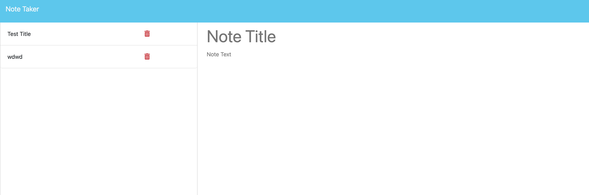

# NoteRiot

## Description

NoteRiot is a task taking app that allows you to record your notes via the webbrowser. It will retain your tasks when navigating away from the page and includes all basic note taking funcitonality.

Live Deployment: https://noteriot-737fd22d7ff2.herokuapp.com/notes

## Table of Contents 

- [Installation](#installation)
- [Usage](#usage)
- [Credits](#credits)
- [License](#license)

## Installation
Requires node package manager

How do I install Dependencies?
npm i

## Usage

Use this app for any note taking needs!

## Credits

## License 

This project is licensed under the MIT License.

Find more about this license here: https://opensource.org/licenses/MIT.

        

## Tests

How do I run tests?
npm start to run server but is accessible via your browser!

## Questions

Please direct your questions towards Ben at:
Github: ZacZacariah
Email: ben-zac@outlook.com

    